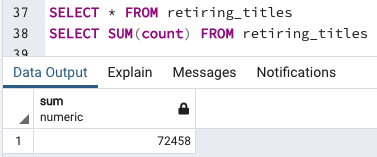
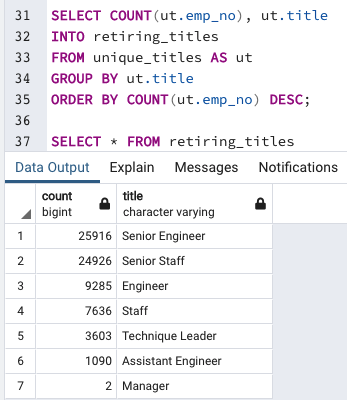
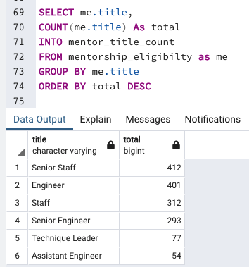
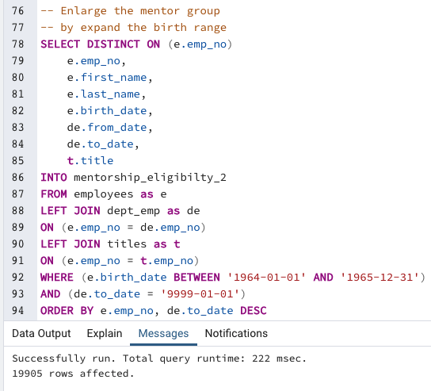
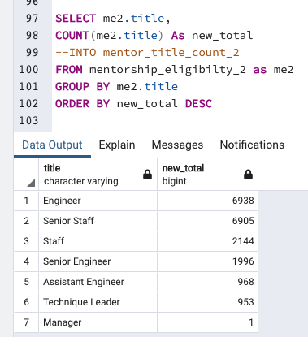

# Pewlett-Hackard-Analysis

## The Overview of the project:

- Pewlett Hackard (P&H) is a large company with thousands of employees meeting the retirement criteria. The company is preparing for this baby boomer retirement in two ways. First, they are offering a retirement package for eligible employees who will be retired soon. Second, they will fulfill the vacancies after those retirees leave the company.

We are helping Bobby, an up-and-coming HR analyst, do employee research. We will use SQL language, ERD, and pdAdmin tool to generate lists of numbers and departments of Pewlett Hackard employees eligible for retirement and help the manager prepare for the upcoming "silver tsunami" with the mentorship eligibility program.

## Result :

- A total number of 72,458 current employees, who were born between 1952-01-01 to 1955-12-31, will be retired soon. Thus, there will be 72,458 new hires to fill these empty roles in the upcoming "silver tsunami."
- Breakdown number of employees by their most recent job title who are about to retire

- For the mentorship program that the company plans to implement, only 1,549 employees are eligible to be mentors if we set the criteria that mentors need to be born between 1965-01-01 and 1965-12-31.
- For 1549 mentors, there will be 72,458 total new hires, meaning that each mentor needs to take almost 47 mentees. The burden for each mentor would be too high.

## Summary & Suggestions:
- It's not enough to have only 1549 mentors for 72458 new hires/replacements. P&H needs to increase its mentor groups.

- From the screenshot above, we can see that if we expand the age range and filter the employees born between 1965-01-01 and 1965-12-31, we will get a total of 19905 eligible mentors, which is almost 13 times more than the previous number of 1,549. With these many mentors, each mentor will only need to train around 3 to 4 new hires, which is more doable.

- The screenshot above is the breakdown of the new eligible mentors. The title counts of mentors look similar to the retirement breakdown table. So we can say that the new mentor table will be able to cover the program if we are going to have 72,458 retirements and new hires happening shortly.
